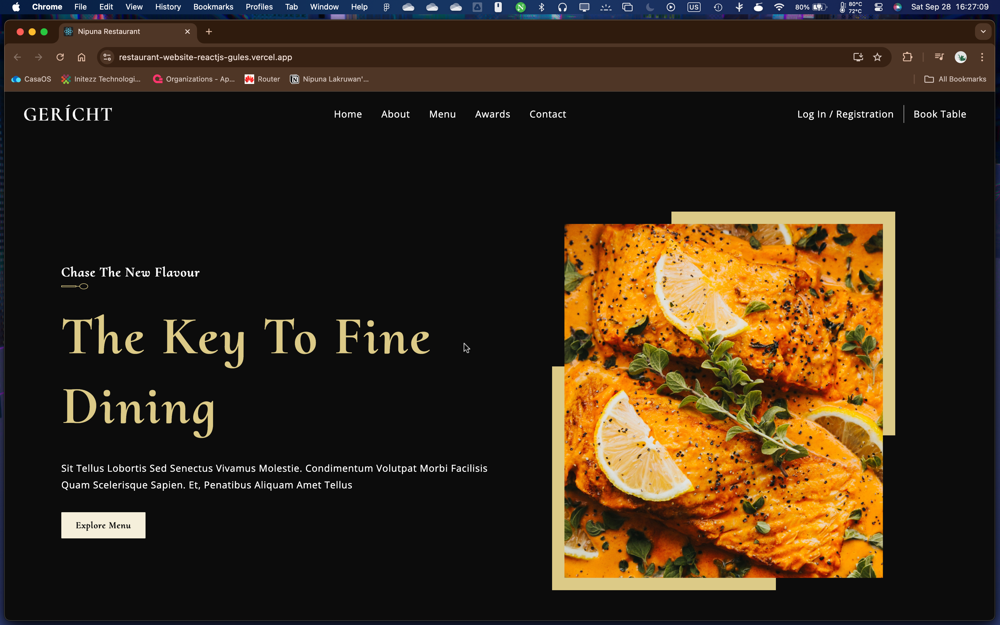
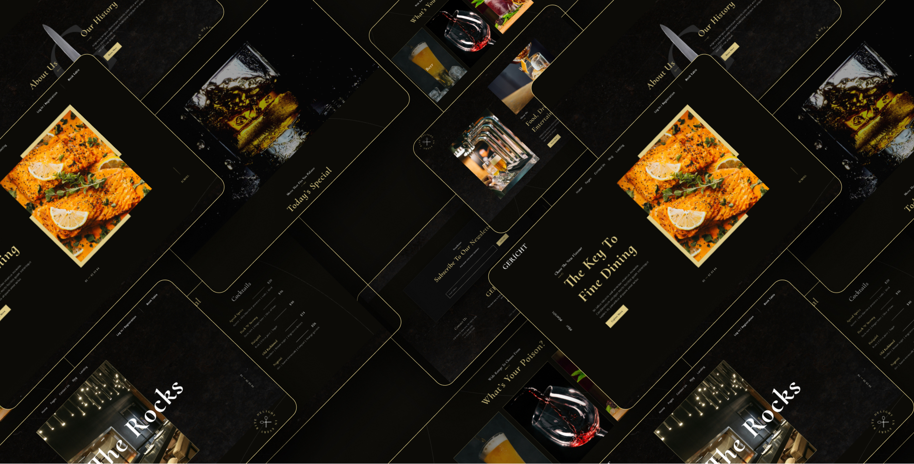

# Restaurant Landing Page - React

This project is a responsive and modern landing page for a restaurant, built using **React**. It features smooth navigation, attractive design, and a focus on fine dining experiences.

## Preview
[](https://restaurant-website-reactjs-gules.vercel.app/)

[](https://restaurant-website-reactjs-gules.vercel.app/)

## Demo Preview


## Table of Contents
- [Features](#features)
- [Technologies Used](#technologies-used)
- [Installation](#installation)
- [Contributing](#contributing)
- [License](#license)

## Features

- **Responsive Design**: Adapts to different screen sizes.
- **Interactive UI**: Engaging elements for an enhanced user experience.
- **Smooth Navigation**: Easy and clear navigation for users.
- **Dark Theme**: Elegant and modern dark-themed design.
- **Menu Display**: Shows special menu items with prices.

## Technologies Used

- **React**: JavaScript library for building the user interface.
- **CSS Modules**: For styling individual components.
- **React Router**: For navigating between pages.
- **Vercel**: Hosting and deployment platform.

## Installation

To get started locally, follow these steps:

1. Clone the repository:
   ```bash
   git clone https://github.com/nipuna-lakruwan/restaurant-website-reactjs.git
   ```
2. Navigate into the project directory:
   ```bash
   cd restaurant-website-reactjs
   ```
3. Install the dependencies:
   ```bash
   npm install
   ```
4. Run the development server:
   ```bash
   npm start
   ```
5. Open `http://localhost:3000` to view the project in the browser.

## Contributing

If you'd like to contribute to this project, please feel free to submit a pull request or open an issue.

## License

This project is licensed under the Apache License - see the [LICENSE](LICENSE) file for details.
